# ANSA Python Meshing Automation

> **Python-based CAE preprocessing automation for ANSA, focused on repeatable surface/volume meshing, mesh-quality control, parametric mesh studies, logging, and solver-oriented export.**


---

## 1. Project Overview

This project develops a Python-driven automation workflow for **finite-element pre-processing in BETA CAE ANSA** using a two-phase implementation.

The target geometry is a **camshaft with two lobes and a shaft**. The workflow automates the repetitive stages of geometry import, entity/property retrieval, surface meshing, volume meshing, quality-controlled remeshing, output generation, and execution logging.

The project is intentionally structured as:

- **Phase 1 — Basic Automation:** validates the core ANSA API call sequence for one mesh size.
- **Phase 2 — Automated Mesh Processor:** wraps the workflow into a reusable `MeshProcessor` class with configuration-driven parameters, multiple mesh sizes, logging, timing, error handling, and automated output naming.

The supplied implementation uses the **NASTRAN ANSA deck** for entity/property operations while the export routine generates **ANSYS `.cdb` output** using `base.OutputAnsys()`. This distinction is important when adapting the project to a production solver workflow.

---

## 2. Problem Statement

Manual CAE meshing becomes repetitive and difficult to reproduce when the same geometry must be meshed at multiple element sizes or processed repeatedly during design studies.

Typical manual steps include:

1. Importing CAD geometry.
2. Selecting component-specific properties/entities.
3. Generating shell/surface meshes.
4. Creating volume meshes.
5. Applying mesh-quality criteria.
6. Remeshing poor-quality regions.
7. Exporting the model.
8. Repeating the entire process for each mesh size.
9. Recording execution status and failures.

This project converts those steps into a **scriptable, repeatable workflow**.

---

## 3. Technical Objectives

### Core objectives

- Automate STEP/CAD geometry import.
- Retrieve ANSA `PSHELL` and `PSOLID` entities programmatically.
- Collect `FACE` and `VOLUME` entities from property definitions.
- Generate structured surface meshes using mapped-block meshing.
- Generate/refine volume meshes using solver-oriented quality controls.
- Execute the same workflow for multiple target element sizes.
- Log processing time, output information, and failures.
- Continue processing subsequent mesh sizes when an individual run fails.
- Generate unique output filenames for each mesh density.
- Produce execution summaries and mesh-study recommendations.

---

## 4. Workflow Architecture

The overall workflow is:

```text
                 ┌──────────────────────┐
                 │      STEP / CAD      │
                 │       Geometry       │
                 └──────────┬───────────┘
                            │
                            ▼
                 ┌──────────────────────┐
                 │ Geometry / Property  │
                 │ Entity Retrieval     │
                 │ PSHELL / PSOLID      │
                 └──────────┬───────────┘
                            │
                            ▼
                 ┌──────────────────────┐
                 │  Surface Meshing     │
                 │   Mapped Blocking    │
                 │  QUAD shell mesh     │
                 └──────────┬───────────┘
                            │
                            ▼
                 ┌──────────────────────┐
                 │   Volume Meshing     │
                 │ Quality-controlled   │
                 │   remeshing/refine   │
                 └──────────┬───────────┘
                            │
                            ▼
                 ┌──────────────────────┐
                 │   Quality Control    │
                 │ Aspect Ratio / etc.  │
                 └──────────┬───────────┘
                            │
                ┌───────────┴───────────┐
                │                       │
                ▼                       ▼
        ┌──────────────┐       ┌─────────────────┐
        │ Mesh Export  │       │ Execution Log   │
        │   .cdb       │       │ Timing / Errors │
        └──────────────┘       └─────────────────┘
```

### UML architecture

The supplied project UML separates responsibilities across the application controller, processing engine, file operations, configuration objects, tracking/statistics, and the ANSA API facade.

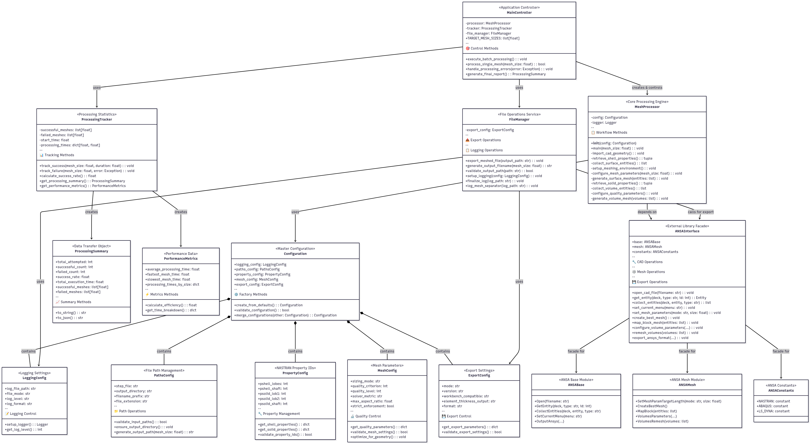

---

## 5. Phase 1 — Basic Automation

`phase1_basic_meshing.py` is the minimal end-to-end implementation.

Its purpose is to verify that the fundamental ANSA Python API sequence works correctly for a **single mesh size** before introducing batching and framework-level functionality.

### Execution sequence

```text
Import STEP
    ↓
Retrieve PSHELL properties
    ↓
Collect FACE entities
    ↓
Set mesh target length
    ↓
Mapped surface meshing
    ↓
Retrieve PSOLID properties
    ↓
Collect VOLUME entities
    ↓
Configure volume quality criteria
    ↓
Volume remeshing
    ↓
Export model
```

The current Phase 1 script targets a **3 mm element edge length** and applies an ANSA volume quality criterion based on `NASTRAN Aspect`, with a maximum aspect ratio of `2.3`.

### Representative API operations

```python
deck = constants.NASTRAN

base.Open("<path-to>/input.STEP")

lobes = base.GetEntity(deck, "PSHELL", 1)
shaft = base.GetEntity(deck, "PSHELL", 2)

ents1 = base.CollectEntities(deck, lobes, "FACE")
ents2 = base.CollectEntities(deck, shaft, "FACE")

mesh.SetMeshParamTargetLength("absolute", 3)

mesh.MapBlock(ents1)
mesh.MapBlock(ents2)

mesh.VolumesParameters(
    3,
    2,
    "NASTRAN Aspect",
    2.3,
    True
)

mesh.VolumesRemesh(vol1)
mesh.VolumesRemesh(vol2)
mesh.VolumesRemesh(vol3)
```

### Why Phase 1 exists

Phase 1 deliberately omits:

- batch processing
- comprehensive logging
- configuration abstractions
- failure tracking
- execution statistics

This makes it useful as a **small validation baseline** for the ANSA API workflow.

---

## 6. Phase 2 — `MeshProcessor`

`phase2_mesh_processor.py` extends the basic workflow into a reusable automation framework.

### Main class

```python
class MeshProcessor:
    ...
```

The class encapsulates:

- CAD import
- PSHELL retrieval
- PSOLID retrieval
- FACE/VOLUME collection
- mesh sizing
- mapped-block surface meshing
- volume quality configuration
- volume remeshing
- workflow logging

The `main(mesh_size)` method acts as the primary orchestration function.

---

## 7. Configuration-Driven Design

The second implementation separates user-adjustable parameters from the processing logic.

### Path configuration

```python
PATHS_CONFIG = {
    'input_paths': {
        'step_file': r"...\CAM_SHAFT.STEP"
    },
    'output_paths': {
        'output_directory': r"...",
        'filename_prefix': "meshsize",
        'file_extension': ".cdb"
    }
}
```

### Property mapping

The model is accessed through configured NASTRAN property IDs:

| Property | Default ID | Purpose |
|---|---:|---|
| `PSHELL` lobes | 1 | Surface properties for lobe regions |
| `PSHELL` shaft | 2 | Surface properties for shaft region |
| `PSOLID` lobe 1 | 3 | First solid volume |
| `PSOLID` lobe 2 | 4 | Second solid volume |
| `PSOLID` shaft | 5 | Shaft volume |

This removes those values from the core processing functions and makes the workflow easier to adapt to another ANSA model.

---

## 8. Mesh Parameterization

The script supports a configurable target mesh-size list:

```python
TARGET_MESH_SIZES = [0.5, 1, 3.0, 5.0, 7.0]
```

This allows the same workflow to be executed at multiple mesh densities without rewriting the meshing logic.

Conceptually:

```text
Smaller element size
        ↓
Higher mesh density
        ↓
Higher computational cost
        ↓
Potentially better geometric/solution resolution
```

The project therefore provides a foundation for **mesh sensitivity and convergence studies**.

---

## 9. Surface Meshing Strategy

The surface stage uses **mapped block meshing** for both the lobe and shaft face groups.

```python
mesh.MapBlock(ents1)
mesh.MapBlock(ents2)
```

The intention is to retain structured/organized element layouts where the geometry permits it.

Representative output:

### 3 mm mesh


### 5 mm mesh

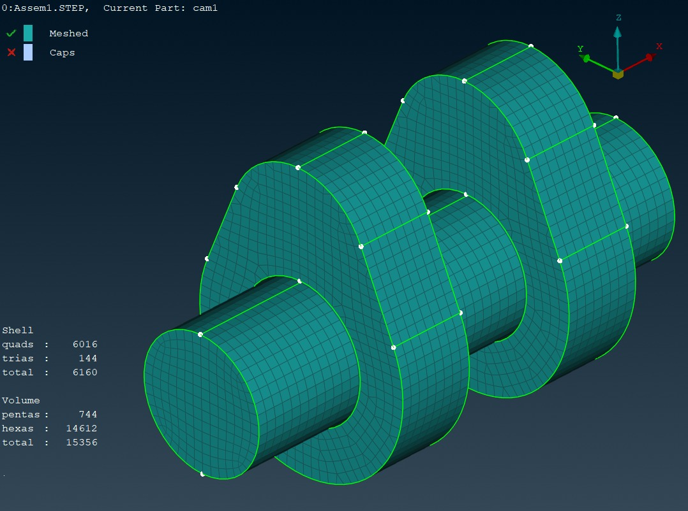

### 7 mm mesh


---

## 10. Volume Meshing and Quality Control

The volume stage is configured through:

```python
mesh.VolumesParameters(
    quality_criterion,
    quality_level,
    solver_metric,
    max_aspect_ratio,
    strict_enforcement
)
```

The supplied configuration is:

```python
'quality_criterion': 3
'quality_level': 2
'solver_metric': "NASTRAN Aspect"
'max_aspect_ratio': 2.3
'strict_enforcement': True
```

Within the script, criterion `3` is documented as **Aspect Ratio**.

The workflow then applies:

```python
mesh.VolumesRemesh(vol1)
mesh.VolumesRemesh(vol2)
mesh.VolumesRemesh(vol3)
```

This makes quality control part of the meshing pipeline rather than a purely manual post-processing step.

---

## 11. Mesh Quality Assessment

The supplied visual set contains quality checks for:

- Aspect ratio
- Warpage
- Jacobian
- Skewness

### Example — 3 mm mesh

| Metric | Visualization |
|---|---|
| Aspect ratio | 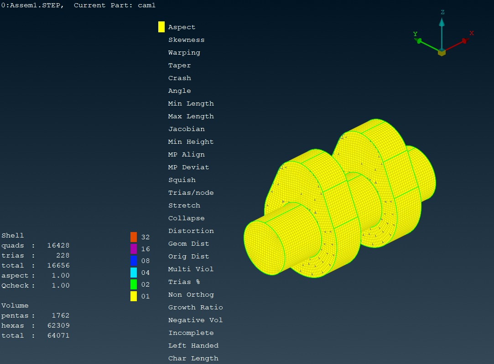 |
| Warpage | 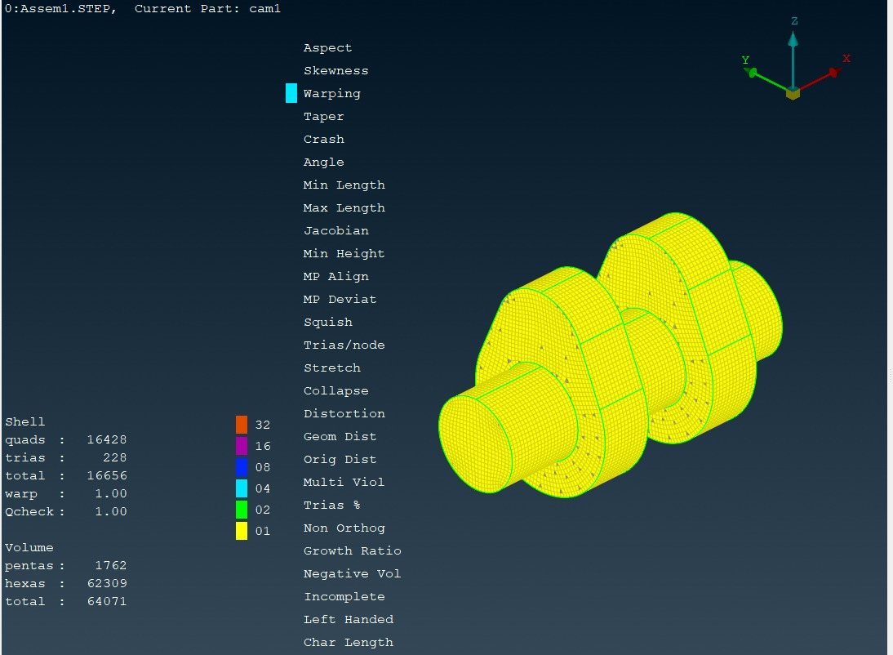 |
| Skewness | 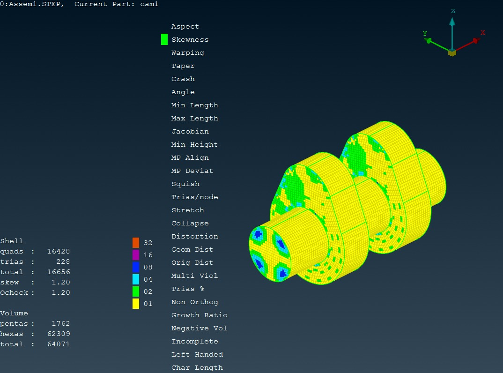 |
| Jacobian |  |

### Example — 5 mm mesh

| Metric | Visualization |
|---|---|
| Aspect ratio | 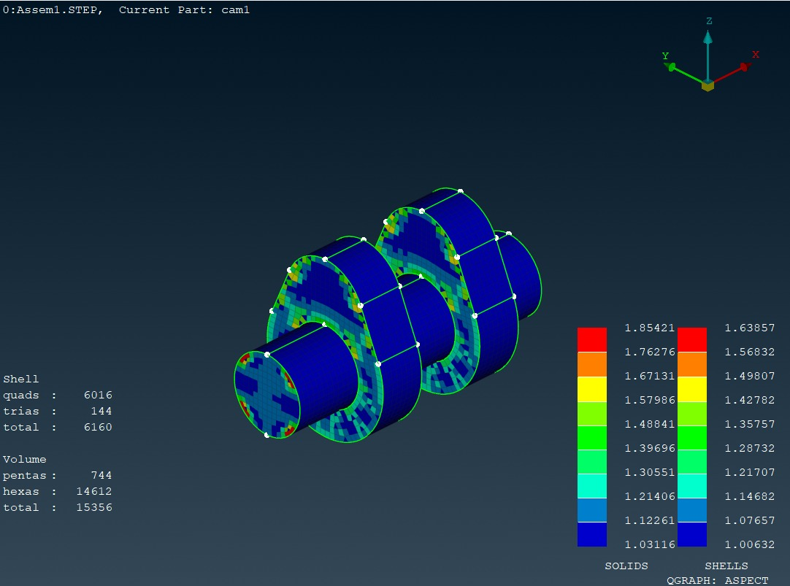 |
| Warpage |  |
| Skewness | 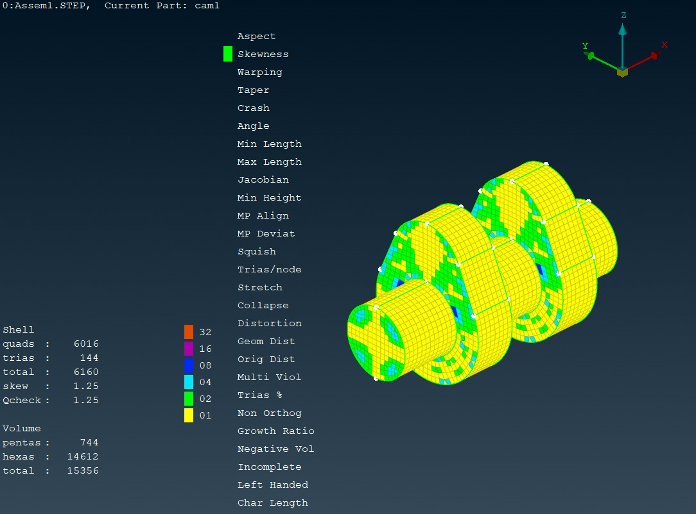 |
| Jacobian | 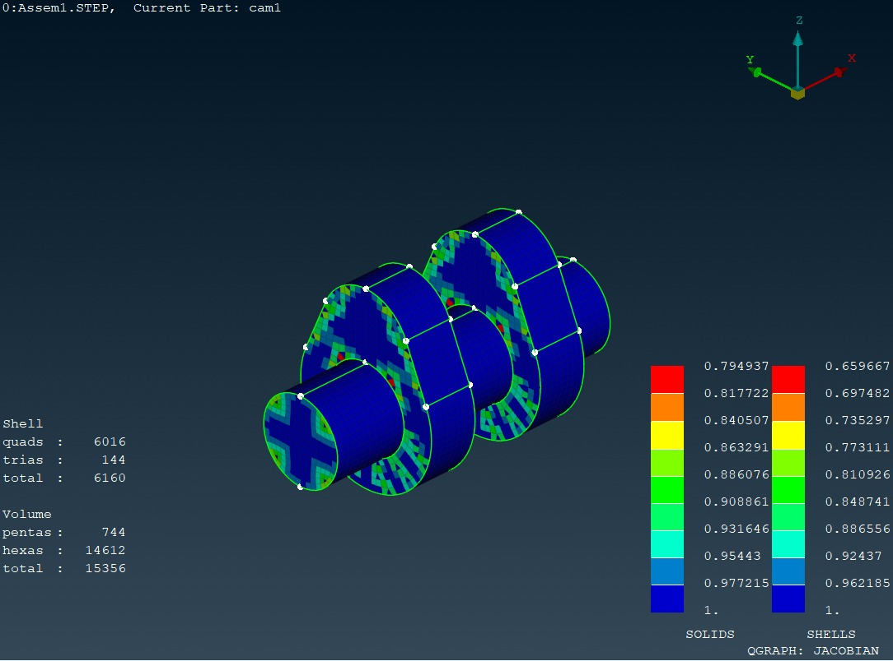 |

### Example — 7 mm mesh

| Metric | Visualization |
|---|---|
| Aspect ratio | 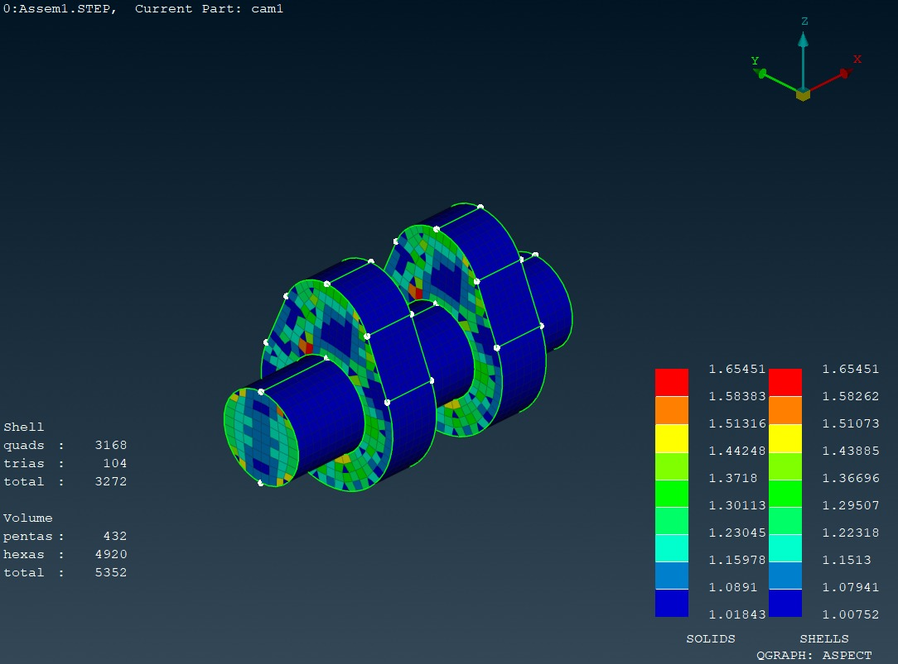 |
| Jacobian |  |
| Skewness | 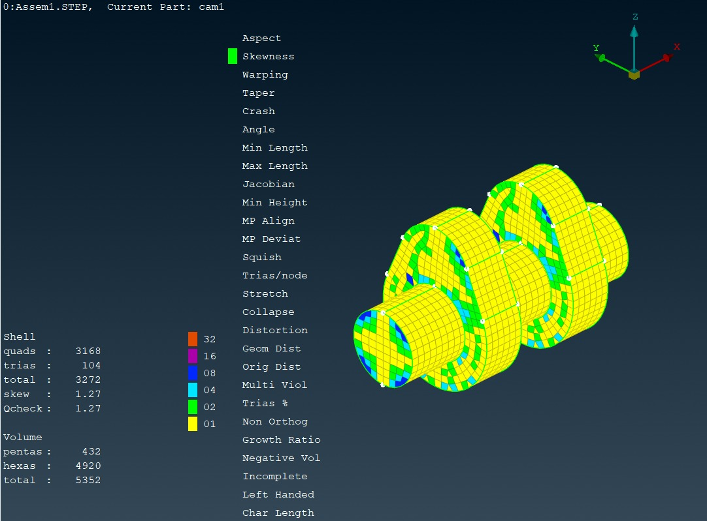 |
| Warpage | 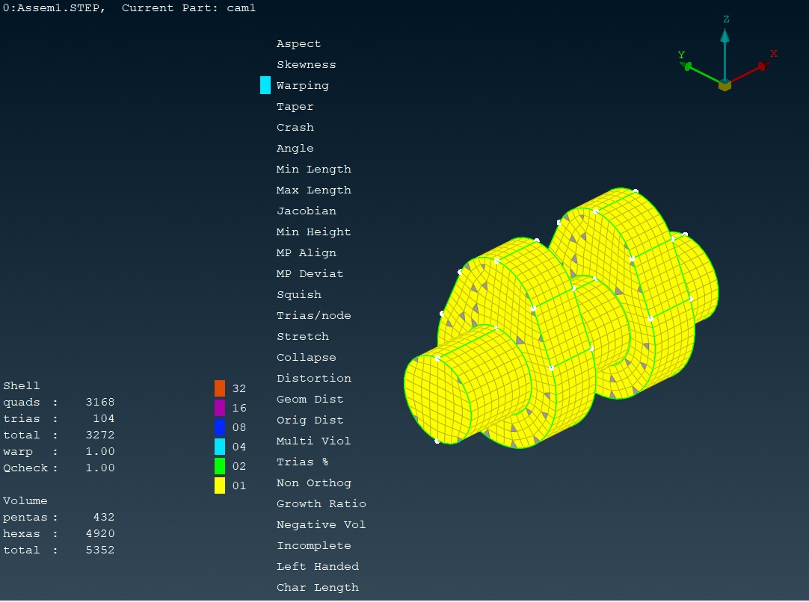 |

---

## 12. Logging and Runtime Tracking

Phase 2 introduces structured logging through Python's `logging` module.

The script records:

- mesh size currently being processed
- workflow start/completion
- geometry import status
- number of collected entities
- mesh parameters
- quality configuration
- meshing time
- export time
- output file size
- error details and tracebacks
- successful/failed mesh sizes
- overall success rate
- total script execution time
- average processing time per mesh

Example logging format:

```text
%(asctime)s - %(levelname)s - %(message)s
```

This provides traceability during batch preprocessing and makes failures easier to diagnose.

---

## 13. Batch Processing Logic

The main execution loop processes each requested mesh size independently:

```python
for mesh_index, mesh_size in enumerate(TARGET_MESH_SIZES, 1):
    ...
    try:
        processor.main(mesh_size)
        export_meshed_file(output_file, EXPORT_CONFIG)
        successful_meshes.append(mesh_size)

    except Exception as e:
        failed_meshes.append(mesh_size)

    finally:
        log_mesh_size_separator(...)
```

### Processing model

```text
Mesh size 0.5 mm ──► process ──► export / log
Mesh size 1.0 mm ──► process ──► export / log
Mesh size 3.0 mm ──► process ──► export / log
Mesh size 5.0 mm ──► process ──► export / log
Mesh size 7.0 mm ──► process ──► export / log
```

An individual failure is recorded in `failed_meshes` rather than immediately terminating the entire batch.

---

## 14. Automated Output Naming

Each mesh size produces a distinct output filename:

```python
filename = f"{filename_prefix}{mesh_size}{file_extension}"
```

With the supplied configuration, outputs follow the pattern:

```text
meshsize0.5.cdb
meshsize1.cdb
meshsize3.0.cdb
meshsize5.0.cdb
meshsize7.0.cdb
```

This is useful for automated mesh studies because generated files can be directly associated with their mesh density.

---

## 15. Export Pipeline

The export function wraps the ANSA export call:

```python
base.OutputAnsys(
    filename=output_path,
    mode=export_config['mode'],
    version=export_config['version'],
    workbench_compatible=export_config['workbench_compatible'],
    output_element_thickness=export_config['element_thickness_output']
)
```

The supplied configuration identifies the output as:

```text
ANSYS CDB format
```

and enables workbench compatibility.

> **Solver/export note:** The processing deck is configured as `constants.NASTRAN`, while the final output function is `base.OutputAnsys()`. When adapting this repository for a different downstream solver, verify the required deck, property definitions, and export API together.

---

## 16. Geometry

The demonstration model is a **two-lobe camshaft** consisting of:

- one cylindrical shaft region
- two lobe regions
- separate `PSHELL` property groups
- separate `PSOLID` volume groups

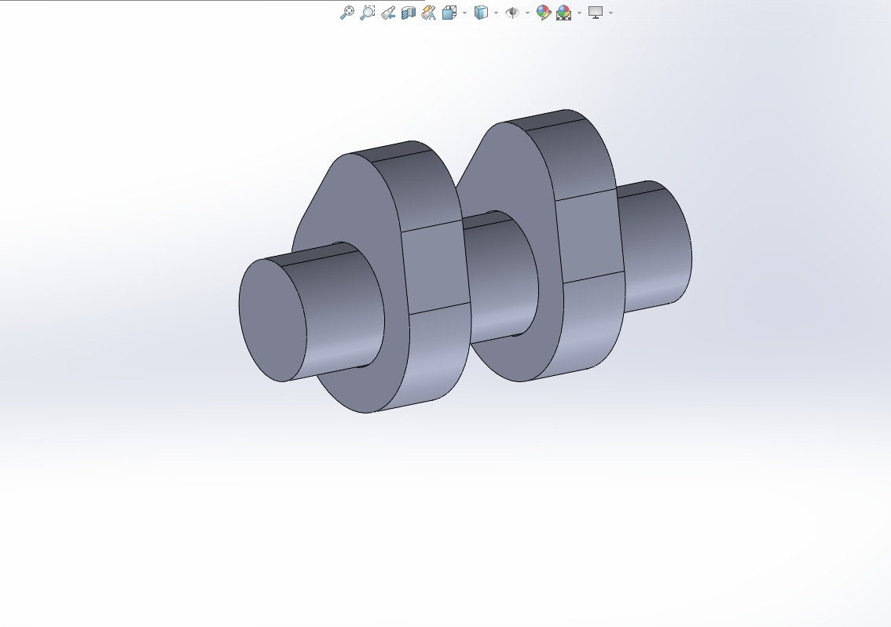

The workflow is therefore organized around explicit component/property grouping rather than blindly meshing every entity in the database.

---

## 17. Project Structure

```text
ansa-python-meshing-automation/
│
├── phase1_basic_meshing.py
├── phase2_mesh_processor.py
│
└── media/
    ├── fig6.1-uml-workflow-diagram.png
    ├── fig8.1-camshaft-cad-model-two-lobes.jpg
    ├── fig8.3-structured-mesh-element-size-3.jpg
    ├── fig8.4-element-size-3-aspect-ratio.jpg
    ├── fig8.5-ideal-mesh-quality-check-table.jpg
    ├── fig8.6-element-size-3-warpage.jpg
    ├── fig8.7-element-size-3-skewness.jpg
    ├── fig8.8-element-size-3-jacobian.jpg
    ├── fig8.9-structured-mesh-element-size-5.jpg
    ├── fig8.10-element-size-5-aspect-ratio.jpg
    ├── fig8.11-element-size-5-warpage.jpg
    ├── fig8.12-element-size-5-jacobian.jpg
    ├── fig8.13-element-size-5-skewness.jpg
    ├── fig8.14-structured-mesh-element-size-7.jpg
    ├── fig8.15-element-size-7-aspect-ratio.jpg
    ├── fig8.16-element-size-7-jacobian.jpg
    ├── fig8.17-element-size-7-skewness.jpg
    ├── fig8.18-element-size-7-warpage.jpg
    ├── fig8.19-final-mesh-jacobian-quality.jpg
    ├── final-mesh-aspect-ratio-quality.jpg
    ├── final-mesh-skewness-quality.jpg
    └── ...
```

---

## 18. Requirements

### Software

- **BETA CAE ANSA** with the Python scripting interface
- Python environment provided by/compatible with ANSA
- Access to the ANSA modules:
  - `ansa.base`
  - `ansa.constants`
  - `ansa.mesh`

The scripts are **not standalone CPython meshing programs**; they depend on the ANSA Python API.

---

## 19. Running the Scripts

### Phase 1

1. Open ANSA.
2. Load the Python script through ANSA's scripting environment.
3. Replace:

```python
base.Open("<path-to>/input.STEP")
```

with the actual STEP-file path.

4. Set the desired output location.
5. Execute the script.

### Phase 2

Update the configuration block in:

```text
phase2_mesh_processor.py
```

At minimum, configure:

```python
LOGGING_CONFIG
PATHS_CONFIG
PROPERTY_CONFIG
MESH_CONFIG
EXPORT_CONFIG
TARGET_MESH_SIZES
```

Then execute inside ANSA.

---

## 20. Recommended Adaptation Workflow

For a new component, the most important step is **property/entity mapping**.

### 1. Prepare the ANSA model

Confirm that the relevant shell and solid entities have the expected property assignments.

### 2. Update property IDs

Modify:

```python
PROPERTY_CONFIG
```

to reflect the new model.

### 3. Update geometry path

Change:

```python
PATHS_CONFIG['input_paths']['step_file']
```

### 4. Select mesh sizes

Modify:

```python
TARGET_MESH_SIZES
```

### 5. Adjust quality criteria

Tune:

```python
MESH_CONFIG['mesh_parameters']['quality_control']
```

for the downstream analysis requirements.

### 6. Validate the output

Check:

- element count
- element type distribution
- aspect ratio
- skewness
- Jacobian
- warpage
- boundary/interface continuity
- solver compatibility

---

## 21. Validation Results

The project report documents the resulting mesh quality for the studied camshaft configuration.

Reported quality observations include:

- Aspect ratios consistently below **2.0**
- Jacobian values within **0.83–1.0**
- Skewness below **0.5**
- Acceptable warpage
- A structured solid mesh containing **29,352 elements**
- Approximately **98.9% hexahedral elements**

These values should be treated as **results for the demonstrated model/configuration**, not universal acceptance limits for every CAE problem.

The project report also documents the engineering motivation for the automation: reducing repetitive meshing effort, improving consistency, supporting parametric studies, and integrating automated quality assurance.

---

## 22. Demonstration of Final Mesh Quality

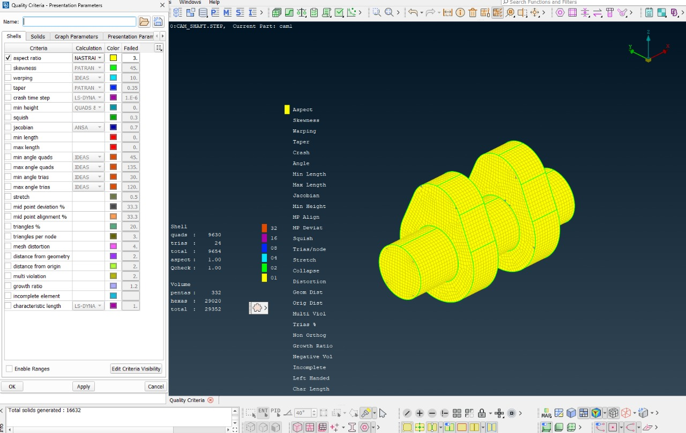

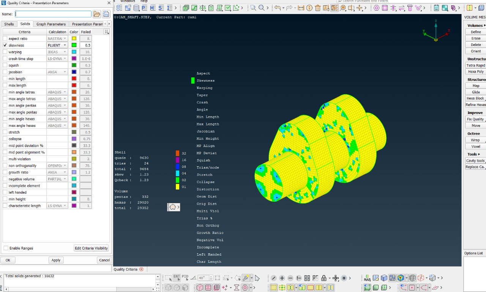

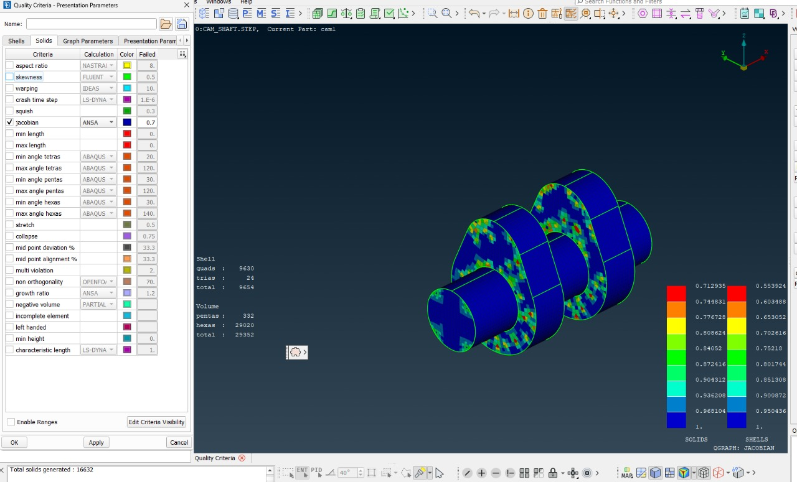

---

## 23. Engineering Significance

The key engineering contribution is not simply generating a mesh through Python. It is the **automation of a repeatable preprocessing decision chain**:

```text
Engineering geometry
      ↓
Model-specific entity identification
      ↓
Parameterized meshing
      ↓
Quality-controlled refinement
      ↓
Batch execution
      ↓
Traceable outputs
      ↓
Solver-ready preprocessing
```

This approach is applicable to:

- mesh convergence studies
- design-of-experiments workflows
- repetitive CAE preprocessing
- batch model generation
- automated solver preparation
- design optimization loops

---

## 24. Limitations

The supplied implementation is a project framework rather than a fully generalized commercial meshing system.

Current limitations include:

- dependence on ANSA-specific Python APIs
- property IDs tied to the demonstration model unless reconfigured
- geometry handling centered around the supplied camshaft workflow
- no standalone geometry healing pipeline
- no automated physics-based mesh adaptation
- no automated solver execution/post-processing loop
- export configuration must be verified for the intended downstream solver
- mesh-quality thresholds are currently parameterized rather than automatically selected from analysis physics

---

## 25. Future Development

Potential extensions include:

- adaptive mesh refinement based on solution gradients
- broader geometry/component support
- automatic CAD feature recognition
- automated convergence analysis
- integration with optimization algorithms
- automated solver execution
- result post-processing
- database-based mesh/quality tracking
- cloud/HPC batch execution
- GUI-based configuration
- automated generation of engineering reports

---

## 26. Technical Skills Demonstrated

**Programming**

- Python
- Object-oriented design
- Exception handling
- Logging
- File/path management
- Batch processing
- Runtime/performance tracking

**CAE / FEA**

- ANSA preprocessing
- Surface meshing
- Volume meshing
- Structured/mapped meshing
- Element-quality assessment
- Parametric mesh studies
- Solver-oriented preprocessing

**Engineering Automation**

- Configuration-driven workflows
- Reproducible preprocessing
- Automated quality control
- Output traceability
- Failure isolation and reporting

---

## 27. Repository Notes

This repository contains the supplied educational implementation and supporting visual documentation from the project.

The scripts are intended to be executed **inside ANSA**, where the `ansa` Python modules are available.

Before running on another model:

1. Verify property IDs.
2. Verify the geometry path.
3. Verify mesh units.
4. Verify quality criteria.
5. Verify the intended solver/export format.

---

## 28. Project Context

**Course:** Aerospace Structures (AS244AI)  
**Institution:** RV College of Engineering  
**Project:** Scripting in ANSA using Python  
**Application:** Automated CAE preprocessing / finite-element meshing

